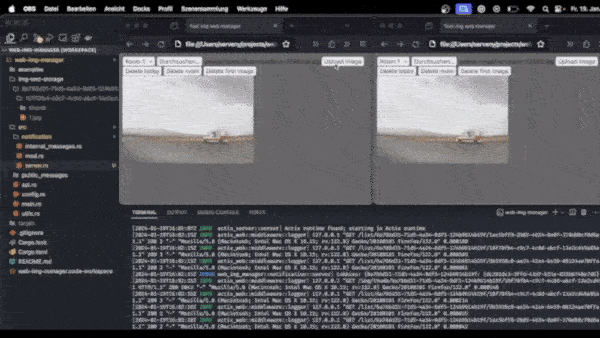

<h1> Web Image Manager</h1>

Little project to up and download image files to/from an actix rust server and get live notification with web sockets. It is intended for a web application in which there are different lobbies, each of which has rooms where you can chat or share your pictures with others.

  

## Features

- [x] ☁️ upload image
- [x] 🖼️ convert image into big and thumb/preview images
- [x] 📁 save files in structured folder (lobby_id/room_id/img_name)
- [x] ❌ delete lobby & room folders
- [x] ❌ delete images
- [x] 📰 upload live notification
- [x] 📰 delete lobby/room/image live notification
- [x] 💬 live chat
- [x] 🔗 TS bindings for public messages
- [ ] 👁️ admin control panel (for image deletion & overview web socket connections)

## Examples

- [x] 🧸 Plain HTML/JS example
- [x] 🧸 HTML/TS example frontend application with usable communication class

## Easy Setup with Docker(Hub)

1. **Create web-image-manager storage volume**: `docker volume create wim-storage`
2. **Pull**: `docker pull serveny/web-img-manager`
3. **Run in interactive mode**: `docker run -p 1871:1871 -v wim-storage:/wim-storage --rm --name wim -it serveny/web-img-manager bash` to create and edit config
   - **Copy**: `cp /wim-storage/config/default-server-config.json /wim-storage/config/server-config.json`
   - **Edit**: `nano /wim-storage/config/server-config.json` Change `images_storage_path` to `/wim-storage/pictures`
   - **Exit**: After saving file write exit in console.
4. **Run**: `docker run -p 1871:1871 -v wim-storage:/wim-storage --rm --name wim serveny/web-img-manager`

## Or build yourself and run with Docker

1. Download this repository and open terminal inside the repository path
2. **Create web-image-manager storage volume**: `docker volume create wim-storage`
3. **Build**: `docker build -t web-img-manager .`
4. **Run in interactive mode**: `docker run -p 1871:1871 -v wim-storage:/wim-storage --rm --name wim -it web-img-manager bash` to create and edit config
   - **Copy**: `cp /wim-storage/config/default-server-config.json /wim-storage/config/server-config.json`
   - **Edit**: `nano /wim-storage/config/server-config.json` Change `images_storage_path` to `/wim-storage/pictures`
   - **Exit**: After saving file write exit in console
5. **Run**: `docker run -p 1871:1871 -v wim-storage:/wim-storage --rm --name wim web-img-manager`

## Add HTTPS support

1. You need a certificate (`cert.pem`) and a private key (`key.pem`) file from your certification provider (for example https://letsencrypt.org/)
2. feature `openssl` for rust build must be enabled (is enabled by default in the dockerfile, but not in the cargo build/run. Use `cargo run --features openssl` for local tests)
3. Upload files (F.e. in console by `nano /wim-storage/cert/cert.pem` and copying the content of your file inside by cache) and set configuration options in `server-config.json`:  
   `"cert_pem_path": "/wim-storage/cert/cert.pem",` 
   `"key_pem_path": "/wim-storage/cert/key.pem",`</code>
4. (Re)start server

## TypeScript-Bindings

If you want to make the API calls via TypeScript, there is an NPM project with all calls and notification events:  
https://www.npmjs.com/package/web-img-manager   
To see how you can implement this, take a look at the example:  
https://github.com/Serveny/web-img-manager/tree/main/ts-bindings/examples/ts-application

## API

#### Types

- `lobby_id`: Uuid v4
- `room_id`: 32 bit Integer
- `session_id`: Uuid v4
- `img_id`: 32 bit Integer (Image block hash)
- `Permission`: Object
  - `url_whitelist`: Restrict access to urls. If None, every url is allowed
  - `restriction`: Rescriction enum
- `Restriction`: Choose one option <ul>
  <li><code>AllowedToAll</code>: Allow access from anywhere by anyone</li>
  <li>
    <code>NeedsConfimation</code>: Allow access after sending serverside confirmation request  
    <b>Configuration option:</b><code>"NeedsConfimation": {url: string, params: {string, any}, headers: {string, string} }</code> 
    <b>Request to the confirmation server:</b> Request to configured url with params and headers 
    <b>Expected response of the confirmation server:</b> <code>{
    is_allowed: boolean,
    error_msg?: String 
  }</code></li>
  <li><code>Denied</code>: Deny access</li>
</ul>

#### Predefined parameters

The configuration options `Restriction: NeedsConfimation` or `afterUploadCheck` allow custom parameters to send with the request. If you configure `lobby_id`, `room_id` or `img_id` as request params, they get filled with the right ids automaticly inside the request. Every other parameter will be sended unchanged to the configured url. Also the name of the predefined parameters are changeable. For example, the configuration `"lobby_id": "YourNamedId"` will produce a request param `"YourNamedId": "be84c114-2431-4e21-aa40-2d831f23be92"` <-- The guid here is an example for a lobby_id

#### Public requests

<table>
  <tr>
    <th>Function</th>
    <th>Method</th>
    <th>URL</th>
    <th>Parameters</th>
    <th>Return format</th>
    <th>Returns</th>
  </tr>
  <tr>
    <td>get room list for lobby</td>
    <td>GET</td>
    <td><code>/list/{lobby_id}</code></td>
    <td>None</td>
    <td>JSON</td>
    <td>JSON encoded list of room_id's  <code>["9b5938c0-ae34-42a4-b459-06124ae70ffa", "10f70fb4-c9c7-4c0d-abcf-13e2cd49a85a"]</code></td>
  </tr>
  <tr>
    <td>get image name list for room</td>
    <td>GET</td>
    <td><code>/list/{lobby_id}/{room_id}</code></td>
    <td>None</td>
    <td>JSON</td>
    <td>JSON encoded list of int img_id's ordered descending by upload date <code>[1,2,3,4,8]</code></td>
  </tr>
  <tr>
    <td>get thumb image</td>
    <td>GET</td>
    <td><code>/img/thumb/{lobby_id}/{room_id}/{img_id}</code></td>
    <td>None</td>
    <td>.webp</td>
    <td>thumb image file</td>
  </tr>
  <tr>
    <td>get big image</td>
    <td>GET</td>
    <td><code>/img/{lobby_id}/{room_id}/{img_id}</code></td>
    <td>None</td>
    <td>.webp</td>
    <td>image file</td>
  </tr>
  <tr>
    <td>upload</td>
    <td>POST</td>
    <td><code>/upload/{lobby_id}/{room_id}</code></td>
    <td><code>image</code>: Image as form file</td>
    <td>JSON</td>
    <td>image upload result <code>{ img_id: 3 }</code></td>
  </tr>
  <tr>
    <td>connect to websocket</td>
    <td>GET</td>
    <td><code>/ws/{lobby_id}</code></td>
    <td>None</td>
    <td>JSON</td>
    <td>null</td>
  </tr>
  <tr>
    <th colspan="6"> Admin requests</th>
  </tr>
 <tr>
    <td>delete lobby or room or img</td>
    <td>POST</td>
    <td><code>/delete/{lobby_id}/{room_id?}/{img_id?}</code></td>
    <td>None</td>
    <td>JSON</td>
    <td>null</td>
  </tr>
<tr>
    <td>send chat message</td>
    <td>POST</td>
    <td><code>/chat</code></td>
    <td><code>lobby_id</code>: String <code>msg</code>: String </td>
    <td>JSON</td>
    <td>null</td>
  </tr>
</table>

### Web sockets messages

<table>
  <tr>
    <th>Direction</th>
    <th>Function</th>
    <th>Format</th>
    <th>Content</th>
  </tr>
  <tr>
    <td>Server -> Client</td>
    <td>Self connected notification</td>
    <td>JSON</td>
    <td><code>event</code>: "Connected", <code>session_id</code></td>
  </tr>
  <tr>
    <td>Server -> Client</td>
    <td>Image uploaded notification</td>
    <td>JSON</td>
    <td><code>event</code>: "ImageUploaded", <code>room_id</code>, <code>img_id</code></td>
  </tr>
  <tr>
    <td>Server -> Client</td>
    <td>Image deleted notification</td>
    <td>JSON</td>
    <td><code>event</code>: "ImageDeleted", <code>room_id</code>, <code>img_id</code></td>
  </tr>
  <tr>
    <td>Server -> Client</td>
    <td>Chat message notification</td>
    <td>JSON</td>
    <td><code>event</code>: "ChatMessage", <code>username</code>, <code>msg</code></td>
  </tr>
</table>

### Server configuration

<table>
  <tr>
    <th>Property</th>
    <th>Description</th>
    <th>Default Value</th>
  </tr>
  <tr>
    <td><code>url</code></td>
    <td>Server url</td>
    <td><code>0.0.0.0</code></td>
  </tr>
  <tr>
    <td><code>port</code></td>
    <td>Server port</td>
    <td><code>1871</code></td>
  </tr>
  <tr>
    <td><code>images_storage_path</code></td>
    <td>Path for storing all uploaded images</td>
    <td><code>./img-storage</code></td>
  </tr>
  <tr>
    <td><code>max_image_size_byte</code></td>
    <td>maximum input image file size in bytes</td>
    <td><code>20971520</code></td>
  </tr>
  <tr>
    <td><code>permissions</code></td>
    <td>Permission for api calls</td>
    <td><code>{ "get_room_list": "AllowedToAll", "upload": {"restriction": "NeedsConfirmation": {"url": "https://confirm.example/check", ...}}, ... }</code></td>
  </tr>
  <tr>
    <td><code>upload_check</code></td>
    <td>Request that sends image after upload to other server and deletes image if check is false</td>
    <td><code>{ "url": "https://confirm.example/check", "not_allowed_msg": "This image is not allowed", check_phase: "BeforeUpload" | "AfterUpload" }</code></td>
  </tr>
</table>

## Troubleshoot

- Can't compile with openssl enabled on windows: https://stackoverflow.com/questions/55912871/how-to-work-with-openssl-for-rust-within-a-windows-development-environment
